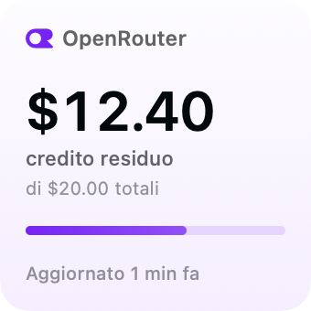
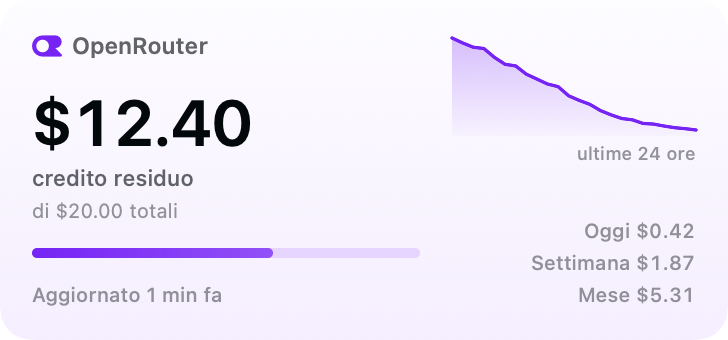
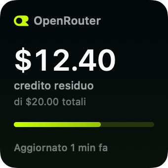
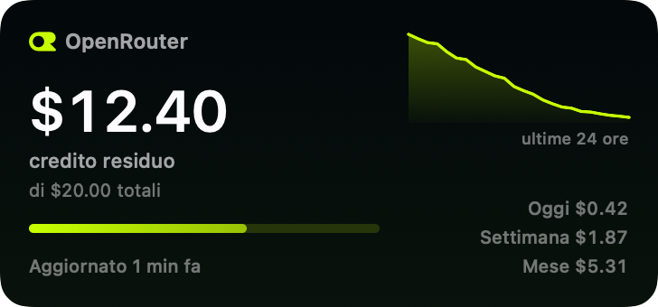
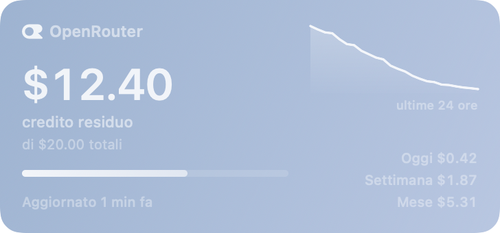
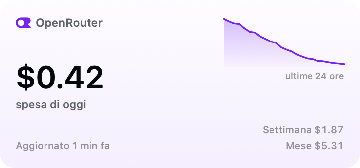
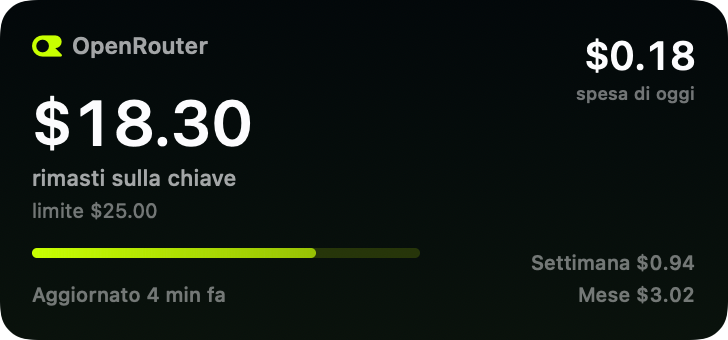

# OpenRouter Credits

Widget per macOS che mostra i crediti disponibili su OpenRouter e la spesa
accumulata, con i due schemi colore del marchio:

- **Giorno** — fondo bianco, accento `#7624F4` (dal logo light);
- **Notte** — fondo nero, accento `#C8FF00` (dal logo dark).
- **Automatico** — segue l'aspetto chiaro o scuro di macOS.

Il widget usa solo font di sistema (SF) e si adatta alle modalità di rendering
di macOS: a colori mostra i due schemi del marchio, in "monocromatico" o
"tinta" lascia fare al sistema come i widget di Apple.

| | |
|---|---|
|  |  |
|  |  |

In modalità "monocromatico" il widget segue il sistema come gli altri:



## Cosa mostra

- **Credito residuo**: se è configurata una chiave di gestione, il saldo del
  conto (`total_credits - total_usage`, endpoint `/credits`); altrimenti il
  residuo del limite impostato sulla chiave API (`limit_remaining`,
  endpoint `/key`).
- **Dettaglio**: totale acquistato, spesa totale, spesa di oggi, della
  settimana e del mese, richieste gratuite rimaste.
- Nel widget medio: mini grafico dell'andamento delle ultime 24 ore (storico
  salvato in locale a ogni aggiornamento).
- Le impostazioni si scelgono dal widget stesso (schema colori, valore in
  evidenza, grafico, centesimi).

## Lingue

L'interfaccia segue la lingua di sistema. Il file base è l'italiano; sono
incluse 12 lingue: italiano, inglese, tedesco, spagnolo, francese, portoghese,
russo, cinese semplificato, hindi, arabo, bengalese e urdu. Arabo e urdu
seguono anche il layout da destra a sinistra.

Le traduzioni stanno in `Localization/<lingua>.lproj/Localizable.strings` e
vengono copiate sia nell'app sia nell'estensione durante la build.
`make check-strings` verifica che tutte le lingue abbiano le stesse chiavi e che
ogni chiave usata nel codice esista.

## Requisiti

- macOS 14 o successivo.
- Xcode o i Command Line Tools (per `swift`, `vtool`, `codesign`, `iconutil`).
- Un certificato di firma **Apple Development** nel portachiavi (Xcode →
  Settings → Accounts). Serve per il sandbox: l'estensione widget viene
  registrata da macOS solo se è sandboxata, e l'app group funziona solo con
  una firma con team ID.

## Installazione

### Dalla release

1. apri il DMG e trascina **OpenRouter Credits** in *Applicazioni*;
2. al primo avvio: clic destro sull'app → **Apri** (la build non è notarizzata),
   oppure `xattr -dr com.apple.quarantine /Applications/OpenRouterCredits.app`;
3. apri l'app, incolla la chiave e aggiungi il widget (vedi sotto).

Nota: la build pubblicata è firmata con un certificato di sviluppo personale.
Su un Mac diverso da quello di chi compila, il container condiviso tra app e
widget potrebbe non essere riconosciuto e il widget mostrare "Configura l'app";
in quel caso conviene ricompilare dai sorgenti con il proprio certificato
(sezione seguente).

### Dai sorgenti

```bash
make build     # compila (universale arm64 + x86_64) e confeziona l'app
make install   # copia in /Applications, registra l'estensione e apre l'app
```

## Configurazione

1. Nell'app apri **OpenRouter Credits**, incolla la **chiave API**
   (`sk-or-v1-…`, da <https://openrouter.ai/settings/keys>) e premi
   **Salva chiavi**.
   - Facoltativo: incolla anche una **chiave di gestione** per vedere il saldo
     del conto invece del solo limite della chiave.
2. Aggiungi il widget: clic destro sul desktop → **Modifica widget…**, cerca
   "OpenRouter", scegli piccolo o medio e trascinalo dove vuoi.
3. Le opzioni si cambiano dal widget stesso: clic destro sul widget →
   **Modifica "Crediti OpenRouter"…** (vedi sotto).

### Impostazioni del widget

Come nei widget di sistema, le opzioni stanno direttamente sul widget: clic
destro sul widget → **Modifica "Crediti OpenRouter"…**

| Impostazione | Cosa fa |
|---|---|
| **Schema colori** | Automatico, Giorno (bianco e viola) o Notte (nero e verde) |
| **Mostra in evidenza** | Quale valore mettere in grande: automatico (credito residuo), spesa di oggi, della settimana, del mese o totale |
| **Grafico 24 ore** | Mostra o nasconde il grafico dell'andamento nel widget medio |
| **Mostra i centesimi** | Se disattivato, gli importi sono arrotondati (`$12` invece di `$12.40`) |

Se il valore scelto non esiste (per esempio la spesa giornaliera con la sola
chiave di gestione), il widget ripiega automaticamente sul credito residuo.




## Aggiornamento

- Il widget ricontrolla i crediti da solo nella propria timeline **ogni 5
  minuti circa** (macOS può concedere tempi più lunghi per risparmiare
  energia).
- L'app non resta in esecuzione: quando chiudi la finestra si chiude anche
  lei, e il widget continua a funzionare. Serve solo a configurare le chiavi e
  a mostrare lo stato; con la finestra aperta ricontrolla **ogni 4 minuti**.
- **Avvia all'accesso** serve solo se vuoi che l'app ricontrolli i dati più
  spesso (aprirà la finestra a ogni accesso): lascialo spento se ti basta il
  widget.

## Dove finiscono i dati

Chiavi e stato stanno in un unico file su questo Mac, nel container condiviso
tra app e widget:

```
~/Library/Group Containers/<TEAM_ID>.com.giovanni.openroutercredits/OpenRouterCredits/
├── config.json   # chiavi (permessi 600) e schema colore predefinito
└── state.json    # ultimo dato letto, ultimo errore, storico 24h
```

Le chiavi non vengono mai inviate altrove: l'unica connessione in uscita è
verso `https://openrouter.ai/api/v1`.

## Struttura del progetto

```
Sources/
  OpenRouterCreditsCore/   # modelli, client API, archivio condiviso, traduzioni
  OpenRouterCreditsUI/     # tema del marchio, glifo OpenRouter, viste del widget
  OpenRouterCreditsWidget/ # estensione WidgetKit (timeline + configurazione)
  OpenRouterCreditsApp/    # app contenitore: chiavi, preferenze, refresh
  CreditsPreviewRender/    # rende i widget in PNG senza passare da WidgetKit
  CreditsIconGen/          # genera l'icona dell'app
Tests/OpenRouterCreditsCoreTests/
Localization/              # 12 lingue (.strings)
docs/previews/             # PNG delle anteprime usate in questo README
scripts/build-app.sh       # compila e confeziona .app + .appex
scripts/build-dmg.sh       # crea il DMG per la release
scripts/install.sh         # installa e registra il widget
scripts/check-widget.sh    # diagnostica
scripts/check-strings.sh   # controllo delle traduzioni
```

Comandi utili:

```bash
make test          # test unitari
make check         # test + controllo delle traduzioni
make preview       # PNG dei widget in docs/previews
make dmg           # DMG pronto per la release
./scripts/check-widget.sh   # stato di app, estensione, dati condivisi
```

Le anteprime si possono rendere anche in un'altra lingua:

```bash
swift run CreditsPreviewRender /tmp/anteprime en   # oppure de, ar, zh-Hans, …
```

## Note tecniche

Alcune cose non ovvie che servono perché un widget costruito fuori da Xcode
funzioni:

- **Sandbox obbligatorio.** `pluginkit` registra l'estensione solo se ha
  l'entitlement `com.apple.security.app-sandbox`. App e widget condividono i
  dati tramite app group (`com.apple.security.application-groups`), e il
  prefisso del gruppo deve essere il team ID della firma.
- **Punto d'ingresso `_NSExtensionMain`.** Xcode collega ogni app extension con
  `LD_ENTRY_POINT = _NSExtensionMain` (vedi `DarwinProductTypes.xcspec`); il
  target del widget usa lo stesso flag, altrimenti il sistema non lo carica
  come estensione.
- **`LC_BUILD_VERSION` corretto a mano.** `swift build` scrive il deployment
  target al posto dell'SDK; macOS sceglie l'aspetto di finestre e widget in
  base all'SDK *collegato*, quindi `scripts/build-app.sh` riscrive entrambi i
  binari con `vtool -set-build-version macos 14.0 <sdk>` e rifirma (la
  modifica invalida la firma).
- **Configurazione via AppIntent.** Le impostazioni del widget (schema colori,
  valore in evidenza, grafico, centesimi) sono parametri di un
  `WidgetConfigurationIntent`: si scelgono dal pannello "Modifica widget" di
  macOS, come per i widget di sistema, senza schermate dentro l'app.
- **Metadata AppIntents obbligatorio.** Perché il sistema possa mostrare quelle
  impostazioni e risolvere la configurazione, l'estensione deve contenere
  `Contents/Resources/Metadata.appintents`. Xcode lo genera con
  `appintentsmetadataprocessor` a partire dai *const values* emessi dal
  compilatore; `scripts/build-app.sh` fa lo stesso dopo la compilazione.
  Senza questo file il widget resta sul placeholder e non riceve mai la
  timeline: i dati vengono letti, ma la vista non si aggiorna.
- **Diagnostica nel container.** L'estensione scrive
  `widget-trace.log` accanto a `config.json`: dice quali chiamate riceve
  (`placeholder`, `snapshot`, `timeline`) e con quali dati.
  `./scripts/check-widget.sh` ne mostra le ultime righe.
- **Traduzioni senza Xcode.** I file `.strings` vengono copiati dentro
  `Contents/Resources` di app ed estensione in fase di build; le stringhe
  dell'interfaccia passano da `Strings.text(…)` (chiave = frase italiana), così
  il fallback è sempre leggibile.

## Diagnostica

```bash
./scripts/check-widget.sh
pluginkit -m -v -p com.apple.widgetkit-extension | grep -i openrouter
```

Se il widget non compare nella galleria:

1. verifica che l'app sia in `/Applications` e che sia stata aperta almeno una
   volta;
2. `killall chronod` e riprova (macOS rilegge l'elenco dei widget);
3. controlla che la firma abbia il sandbox: `./scripts/check-widget.sh`.

Se il widget mostra "Configura l'app" ma nell'app la chiave c'è, il widget non
sta leggendo il container condiviso: ricompila e reinstalla con
`make install` (serve una firma con team ID valido).
